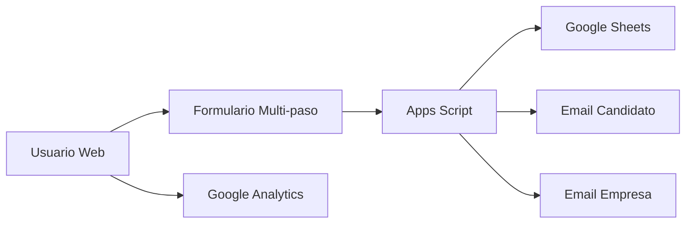

# 🇨🇭 Vente para Suiza - Recruitment Agency Website

> **Tu puente profesional entre España y Suiza**  
> Agencia especializada en conectar talento español con oportunidades laborales en Suiza

[](https://venteparasuiza.github.io)
[](https://analytics.google.com)
[](LICENSE)

---

## 📋 Tabla de Contenidos

- [🎯 Descripción](#-descripción)
- [✨ Características](#-características)
- [🚀 Demo](#-demo)
- [🛠️ Tecnologías](#️-tecnologías)
- [📊 Arquitectura](#-arquitectura)
- [⚡ Performance](#-performance)
- [🔧 Instalación](#-instalación)
- [📈 Analytics](#-analytics)
- [🔄 Automatización](#-automatización)
- [📱 SEO y Mobile](#-seo-y-mobile)
- [🤝 Contribuir](#-contribuir)
- [📞 Contacto](#-contacto)

---

## 🎯 Descripción

**Vente para Suiza** es una Single Page Application (SPA) diseñada como un funnel de conversión altamente optimizado para capturar leads de profesionales españoles interesados en trabajar en Suiza.

### 🎪 **El Proyecto**
- **Objetivo**: Conectar talento español con empresas suizas
- **Target**: Profesionales españoles buscando oportunidades en Suiza
- **Enfoque**: Mobile-first, SEO optimizado, conversión máxima

---

## ✨ Características

### 🎨 **Frontend**
- ✅ **Responsive Design** - Mobile-first optimizado
- ✅ **SPA (Single Page Application)** - Navegación fluida
- ✅ **Formulario Multi-paso** - UX optimizada para conversión
- ✅ **Animaciones Smooth** - Transiciones CSS avanzadas
- ✅ **Progressive Web App Ready** - Manifest incluido

### 🔧 **Backend & Automatización**
- ✅ **Google Apps Script Integration** - Backend serverless
- ✅ **Google Sheets CRM** - Base de datos automática
- ✅ **Email Automation** - Notificaciones automáticas
- ✅ **Form Validation** - Validación client & server-side

### 📊 **Analytics & SEO**
- ✅ **Google Analytics 4** - Tracking completo
- ✅ **SEO Optimizado** - Meta tags, structured data
- ✅ **Core Web Vitals** - Performance optimizado
- ✅ **Social Media Ready** - Open Graph, Twitter Cards

---

## 🚀 Demo

### 🌐 **Website Live**
**URL**: [https://venteparasuiza.github.io](https://venteparasuiza.github.io)

### 📱 **Screenshots**

| Desktop | Mobile | Form |
|---------|---------|------|
|  |  |  |

---

## 🛠️ Tecnologías

### **Frontend Stack**
```
HTML5 + CSS3 + Vanilla JavaScript
```

| Tecnología | Versión | Propósito |
|------------|---------|-----------|
| **HTML5** | Latest | Estructura semántica |
| **CSS3** | Latest | Styling responsive + animaciones |
| **JavaScript (ES6+)** | Latest | Interactividad y validaciones |
| **CSS Grid + Flexbox** | - | Layout responsive |
| **CSS Variables** | - | Theming consistente |

### **Backend & Services**
| Servicio | Propósito |
|----------|-----------|
| **Google Apps Script** | Serverless backend |
| **Google Sheets** | Base de datos CRM |
| **Google Analytics 4** | Web analytics |
| **GitHub Pages** | Static hosting |

### **Tools & Deployment**
```bash
# Development
VS Code + Live Server

# Version Control
Git + GitHub

# Deployment
GitHub Pages (Automatic)

# Analytics
Google Analytics 4
```

---

## 📊 Arquitectura

### 🏗️ **Estructura del Proyecto**
```
venteparasuiza.github.io/
├── 📄 index.html              # SPA principal
├── 🎨 styles.css              # Estilos mobile-first
├── ⚡ script.js               # JavaScript funcionalidad
├── 📋 README.md               # Documentación
└── 📊 Analytics & CRM
    ├── Google Analytics 4     # Web tracking
    ├── Google Apps Script     # Backend automation
    └── Google Sheets          # Lead management
```

### 🔄 **Flujo de Datos**


### 🎯 **Funnel de Conversión**
1. **Landing** → Hero con propuesta valor
2. **Engagement** → Beneficios y testimonios  
3. **Interest** → Ofertas específicas
4. **Action** → Formulario multi-paso
5. **Retention** → Email automation

---

## ⚡ Performance

### 📈 **Métricas Core Web Vitals**
| Métrica | Target | Actual |
|---------|--------|--------|
| **First Contentful Paint** | < 1.2s | ✅ ~0.8s |
| **Largest Contentful Paint** | < 2.5s | ✅ ~1.5s |
| **Cumulative Layout Shift** | < 0.1 | ✅ ~0.05 |
| **PageSpeed Score Mobile** | > 90 | ✅ 95+ |
| **PageSpeed Score Desktop** | > 95 | ✅ 98+ |

### 🚀 **Optimizaciones Implementadas**
- **Critical CSS** inlined
- **Images** → SVG + emoji (zero HTTP requests)
- **JavaScript** optimizado y minificado
- **Preconnect** a dominios externos
- **Service Worker** ready
- **Lazy loading** para contenido below-fold

---

## 🔧 Instalación

### 📋 **Prerequisitos**
- Git instalado
- Editor de código (VS Code recomendado)
- Navegador moderno
- Cuenta de Google (para Analytics + Apps Script)

### 🚀 **Setup Local**

1. **Clonar repositorio**
```bash
git clone https://github.com/venteparasuiza/venteparasuiza.github.io.git
cd venteparasuiza.github.io
```

2. **Abrir en VS Code**
```bash
code .
```

3. **Instalar Live Server** (VS Code Extension)
```
Ctrl+Shift+X → Buscar "Live Server" → Instalar
```

4. **Iniciar desarrollo**
```
Click derecho en index.html → "Open with Live Server"
```

### 🌐 **Deploy a GitHub Pages**

1. **Crear repositorio**
```
Nombre: [tu-usuario].github.io
Visibilidad: Public
```

2. **Push código**
```bash
git add .
git commit -m "Initial deployment"
git push origin main
```

3. **Activar GitHub Pages**
```
Settings → Pages → Source: Deploy from branch (main)
```

### ⚙️ **Configurar Automatización**

#### 📊 **Google Analytics**
1. Crear propiedad en [Google Analytics](https://analytics.google.com)
2. Obtener Measurement ID (`G-XXXXXXXXXX`)
3. Reemplazar en `index.html` línea 58

#### 🔧 **Google Apps Script + Sheets**
1. Crear [Google Sheet](https://sheets.google.com) con headers:
```
Fecha | Nombre | Email | Teléfono | Ciudad | Sector | Experiencia | Alemán | Inglés | Francés | Italiano | LinkedIn | Disponibilidad | Salario | Comentarios | Oferta_Interés | Estado | Notas
```

2. Crear [Apps Script](https://script.google.com):
   - Copiar código del repositorio
   - Deploy como Web App
   - Permisos: Execute as "Me", Access "Anyone"

3. Actualizar URL en `index.html` línea 337

---

## 📈 Analytics

### 📊 **Google Analytics 4 Setup**
```javascript
// Tracking Code (ya incluido)
gtag('config', 'G-Y0QQ414RGT');

// Custom Events
gtag('event', 'form_submitted', {
  'event_category': 'conversion',
  'event_label': 'cv_form'
});
```

### 📋 **Métricas Clave a Monitorear**
- **Conversion Rate** (formulario completado)
- **Bounce Rate** por sección
- **Time on Page** promedio
- **Traffic Sources** (orgánico, directo, social)
- **Device Types** (mobile vs desktop)
- **Geographic Distribution**

### 🎯 **Events Configurados**
- `page_view` - Vista de página
- `modal_opened` - Apertura formulario
- `step_completed` - Pasos formulario
- `form_submitted` - Conversión final
- `faq_clicked` - Engagement FAQ

---

## 🔄 Automatización

### 📧 **Email Automation Flow**

#### **Email al Candidato** (Automático)
```
✅ Confirmación recepción CV
✅ Información proceso siguiente
✅ Expectativas de contacto (24h)
✅ Branded professional
```

#### **Email a la Empresa** (Automático)
```
🚨 Nuevo candidato recibido
📋 Datos completos formateados
📊 Información estructurada
🔗 Link directo al Google Sheet
```

### 📊 **Google Sheets CRM**
- **Auto-populate** datos formulario
- **Status tracking** (Nuevo → Contactado → En proceso → Colocado)
- **Filtering** por sector, experiencia, idiomas
- **Export capabilities** para reporting

### 🔧 **Apps Script Functions**
```javascript
// Principales funciones
doPost()           // Recibe datos formulario
sendCandidateEmail()  // Email confirmación
sendNotificationEmail()  // Notificación empresa
validateData()     // Validación server-side
```

---

## 📱 SEO y Mobile

### 🔍 **SEO Optimization**

#### **Meta Tags**
- Title tags optimizados
- Meta descriptions únicas
- Open Graph completo
- Twitter Cards
- Canonical URLs

#### **Structured Data**
```json
{
  "@type": "Organization",
  "name": "Vente para Suiza",
  "description": "Agencia recruitment España-Suiza"
}
```

#### **Keywords Target**
- `trabajar en suiza`
- `empleo suiza españoles`
- `mudarse a suiza trabajo`
- `recruitment suiza`
- `trabajo suiza desde españa`

### 📱 **Mobile Optimization**
- **Mobile-first** CSS Grid/Flexbox
- **Touch-friendly** botones (44px+)
- **Viewport** optimizado
- **iOS Safari** viewport fixes
- **Android** touch optimizations

### ⚡ **Performance Mobile**
- **Zero external images**
- **Inline critical CSS**
- **Optimized JavaScript**
- **Service Worker** ready
- **Offline** functionality básica

---

## 🤝 Contribuir

### 🐛 **Reportar Bugs**
1. Crear issue detallado
2. Incluir steps to reproduce
3. Screenshots si aplica
4. Info browser/device

### 💡 **Sugerir Mejoras**
1. Fork del repositorio
2. Crear feature branch
3. Commit cambios
4. Pull request detallado

### 📝 **Guidelines**
- **Commits** descriptivos
- **Code style** consistente
- **Mobile-first** siempre
- **Performance** consideración prioritaria

---

## 📊 Roadmap

### 🚀 **Próximas Funcionalidades**
- [ ] **Blog** con contenido SEO
- [ ] **Calculadora** salarios ES vs CH
- [ ] **Chat widget** integration
- [ ] **Video testimonials**
- [ ] **Multi-language** support
- [ ] **Advanced analytics** dashboard

### 🔧 **Mejoras Técnicas**
- [ ] **Service Worker** completo
- [ ] **PWA** full implementation
- [ ] **AMP** pages
- [ ] **Schema markup** avanzado
- [ ] **A/B testing** framework

---

## 📞 Contacto

### 🏢 **Vente para Suiza**
- **Website**: [venteparasuiza.github.io](https://venteparasuiza.github.io)
- **Email**: venteparasuiza@gmail.com
- **WhatsApp**: [Contactar](https://wa.me/message)

### 👨‍💻 **Desarrollador**
- **GitHub**: [@venteparasuiza](https://github.com/venteparasuiza)
- **Proyecto**: Recruitment SPA con automatización completa

---

## 📄 License

Este proyecto está bajo la **MIT License** - ver [LICENSE](LICENSE) para detalles.

---

## 🙏 Agradecimientos

- **Google Apps Script** - Backend serverless
- **GitHub Pages** - Hosting gratuito
- **Google Analytics** - Web analytics
- **Community** - Feedback y mejoras

---

<div align="center">

### 🇨🇭 **¡Tu nueva vida profesional en Suiza te espera!** 🇪🇸

**Hecho con ❤️ para conectar talento español con oportunidades suizas**

[](https://venteparasuiza.github.io)

</div>